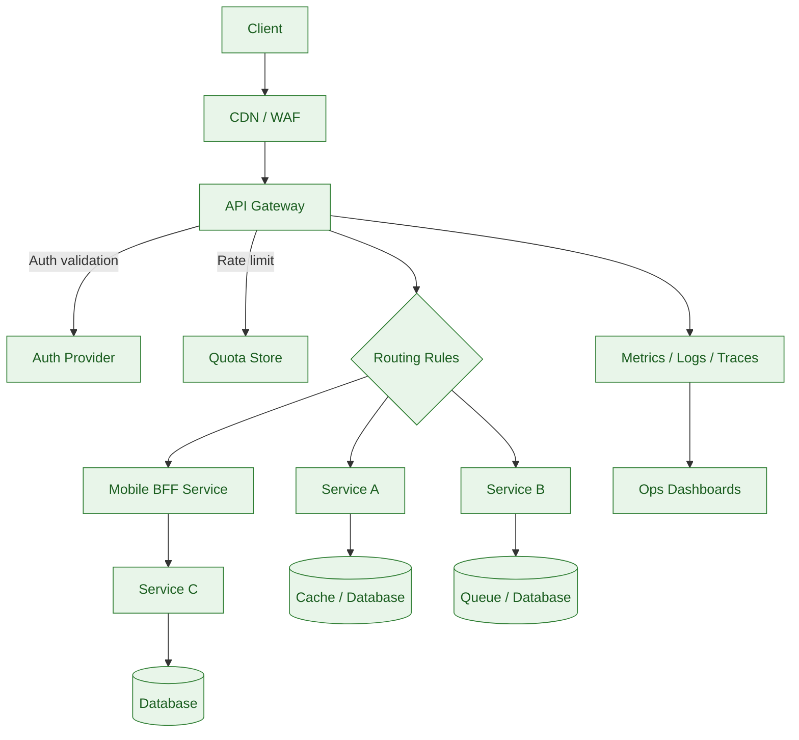

# API Gateway Request Flow

**Notes**
- Edge layer shields against DDoS/threats before the gateway.
- Gateway handles authentication, rate limiting, and routing.
- Mobile BFF tailors responses for mobile clients.
- Observability pipeline catches metrics/logs/traces for dashboards.
