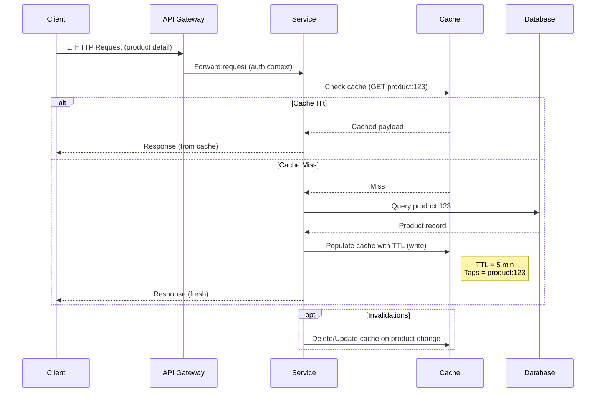

# Cache Read/Write Flow (Cache-Aside)

**Key Points**
- Cache miss triggers database read and cache populate with TTL.
- Optional invalidation step ensures updates propagate (e.g., on write path/event).
- Mention TTL and tagging strategy during interviews; highlight idempotent writes.
