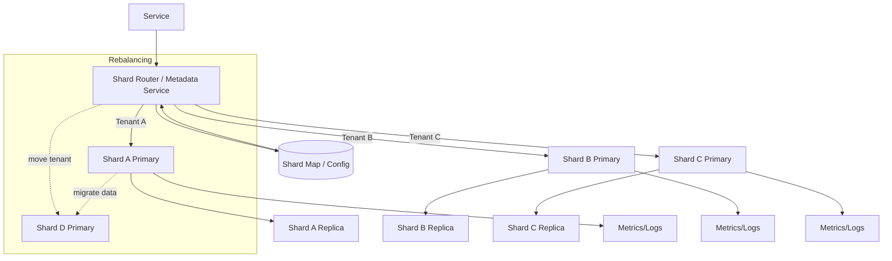

# Data Sharding Topology



**Notes**
- Router consults shard map to send tenants to the correct primary.
- Each shard has primaries and replicas for HA; monitoring feeds are shown for observability.
- Rebalancing adds new shard and migrates tenant/data gradually.
```
