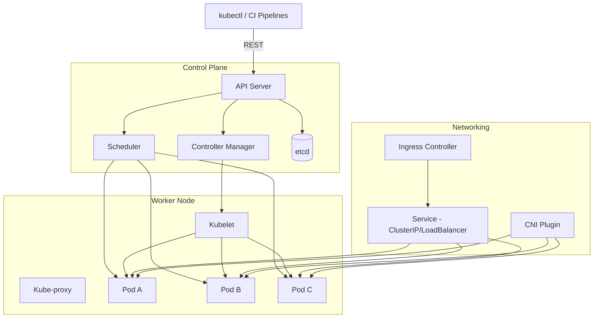

# Kubernetes Cluster Architecture

**Notes**
- Control plane components manage desired state; workers (one shown, replicated as needed) run kubelet/kube-proxy and host pods.
- Ingress and Services expose workloads; CNI provides pod networking.
- External clients interact via `kubectl`/CI hitting the API server.
