# Kubernetes Rolling Update Timeline

```mermaid
gantt
    dateFormat  X
    axisFormat  %s
    title Deployment Rolling Update (replicas=4, maxSurge=1, maxUnavailable=1)

    section Steps
    Drain old pod #1          :done,    0, 1
    Launch surge pod #5       :active,  1, 1
    Wait for readiness #5     :         2, 1
    Route traffic to #5       :         3, 1
    Terminate old pod #2      :         4, 1
    Launch surge pod #6       :         5, 1
    Readiness check #6        :         6, 1
    Continue until pods rotated :       7, 3
```

**Notes**
- With `maxSurge=1` and `maxUnavailable=1`, deployment keeps 4–5 pods during rollout.
- Readiness probes must pass before shifting traffic; if they fail, rollout pauses/rolls back.
