# Kubernetes Rolling Update Timeline

```mermaid
gantt
    title Deployment Rolling Update
    dateFormat  X
    axisFormat  %s

    section Phase 1
    Launch surge pod (replicas=5)   :active, 0, 1
    Readiness check                 :         1, 1

    section Phase 2
    Route traffic to new pod (stable=4) : 2, 1
    Terminate old pod                  : 3, 1

    section Phase 3
    Repeat for remaining pods         : 4, 4
```

**Notes**
- `maxSurge=1` and `maxUnavailable=1` keep total replicas between 4 and 5 during rollout.
- Readiness probes gate traffic; a failed probe pauses or rolls back.
