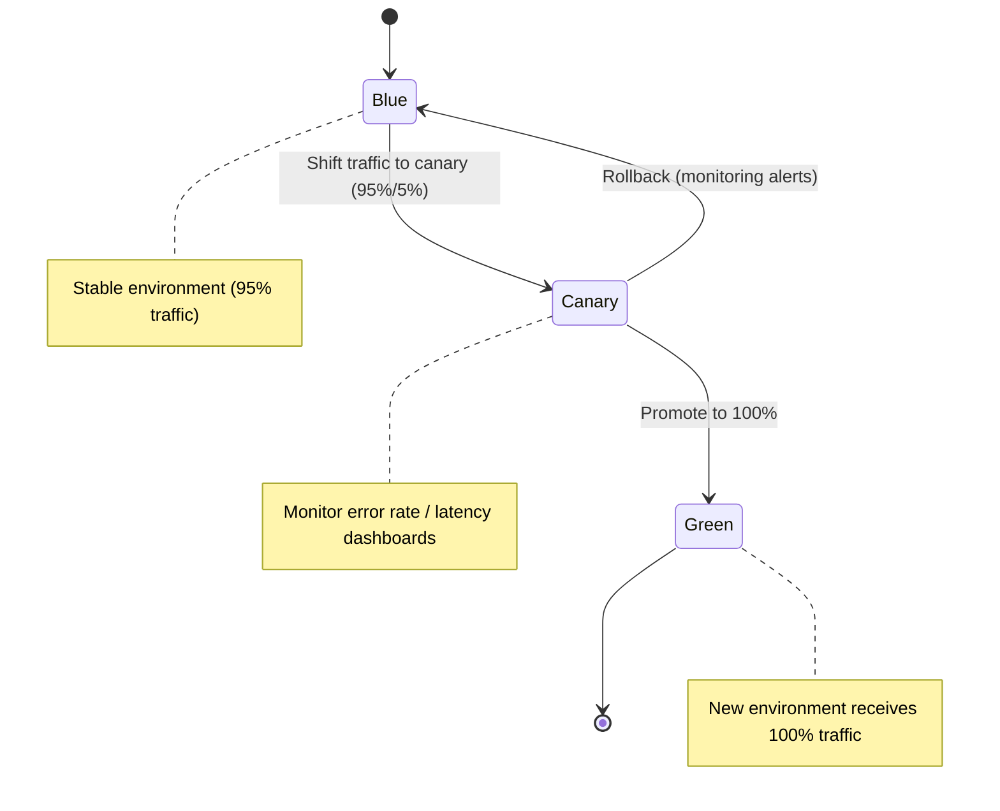

# Load Balancer Blue/Green Deployment


```mermaid
stateDiagram-v2
    [*] --> Blue
    Blue --> Canary: Shift traffic to canary (95%/5%)
    Canary --> Green: Promote to 100%
    Green --> [*]
    Canary --> Blue: Rollback (monitoring alerts)

    note right of Blue: Stable environment (95% traffic)
    note right of Canary: Monitor error rate / latency dashboards
    note right of Green: New environment receives 100% traffic
```

**Notes**
- Show traffic percentages and monitoring checkpoints; rollback returns traffic to blue if canary metrics spike.
```
