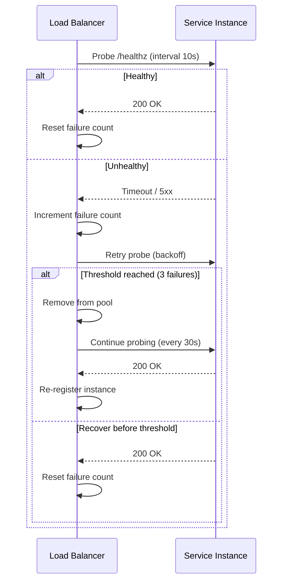

# Load Balancer Health Check Sequence


```mermaid
sequenceDiagram
    participant LB as Load Balancer
    participant Service as Service Instance

    LB->>Service: Probe /healthz (interval 10s)
    alt Healthy
        Service-->>LB: 200 OK
        LB->>LB: Reset failure count
    else Unhealthy
        Service-->>LB: Timeout / 5xx
        LB->>LB: Increment failure count
        LB->>Service: Retry probe (backoff)
        alt Threshold reached (3 failures)
            LB->>LB: Remove from pool
            LB->>Service: Continue probing (every 30s)
            Service-->>LB: 200 OK
            LB->>LB: Re-register instance
        else Recover before threshold
            Service-->>LB: 200 OK
            LB->>LB: Reset failure count
        end
    end
```

**Notes**
- Combine active probes with passive checks; remove instance after threshold, reinstate once healthy (3 consecutive successes).
```
