# Microservices Context Map

```mermaid
graph TB
    classDef infra fill:#e3f2fd,stroke:#1565c0,color:#0d47a1;
    classDef service fill:#fff3e0,stroke:#ef6c00,color:#bf360c;
    classDef data fill:#f1f8e9,stroke:#33691e,color:#1b5e20;

    subgraph Shared Infrastructure
        direction TB
        Gateway[API Gateway]
        Discovery[Service Discovery]
        Observability[Observability Stack]
    end

    subgraph Catalog Context
        direction TB
        CatalogService[Catalog Service]
        InventoryService[Inventory Service]
        PricingService[Pricing Service]
        CatalogDB[(Catalog DB)]
    end

    subgraph Orders Context
        direction TB
        OrderService[Order Service]
        PaymentService[Payment Service]
        ShippingService[Shipping Service]
        OrderDB[(Order DB)]
    end

    subgraph Users Context
        direction TB
        AuthService[Auth Service]
        ProfileService[Profile Service]
        UserDB[(User DB)]
    end

    Gateway --> CatalogService
    Gateway --> OrderService
    Gateway --> AuthService

    CatalogService --> Discovery
    OrderService --> Discovery
    AuthService --> Discovery

    CatalogService --> Observability
    OrderService --> Observability
    AuthService --> Observability

    CatalogService --> CatalogDB
    InventoryService --> CatalogDB
    PricingService --> CatalogDB

    OrderService --> OrderDB
    PaymentService --> OrderDB
    ShippingService --> OrderDB

    AuthService --> UserDB
    ProfileService --> UserDB

    class Gateway,Discovery,Observability infra;
    class CatalogService,InventoryService,PricingService,OrderService,PaymentService,ShippingService,AuthService,ProfileService service;
    class CatalogDB,OrderDB,UserDB data;
```

**Notes**
- Shared infrastructure provides gateway, discovery, and observability for bounded contexts.
- Each context owns its data store; additional services follow the same pattern (not shown).
- Highlight ownership boundaries and shared dependencies during interviews.
