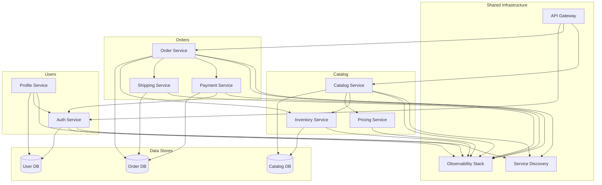

# Microservices Context Map

**Notes**
- Shared infrastructure provides gateway, discovery, and observability for bounded contexts.
- Each bounded context (Catalog, Orders, Users) owns its data store; services communicate via APIs.
- Highlight ownership boundaries and shared dependencies during interviews.
