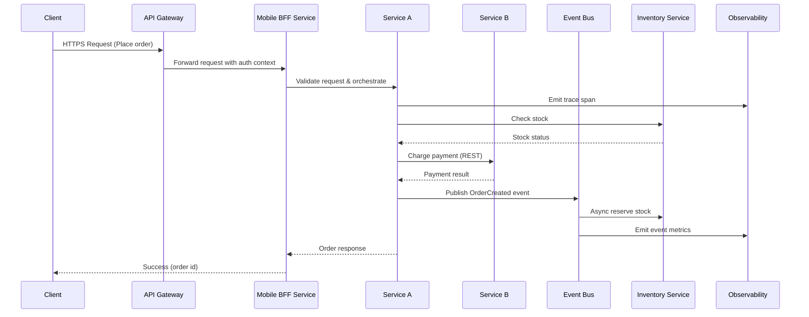

# Microservices Request Journey

**Notes**
- Sequence mixes synchronous calls with async events; highlight tracing spans and metrics.
- Mention saga/compensation logic if payment or inventory fails.
