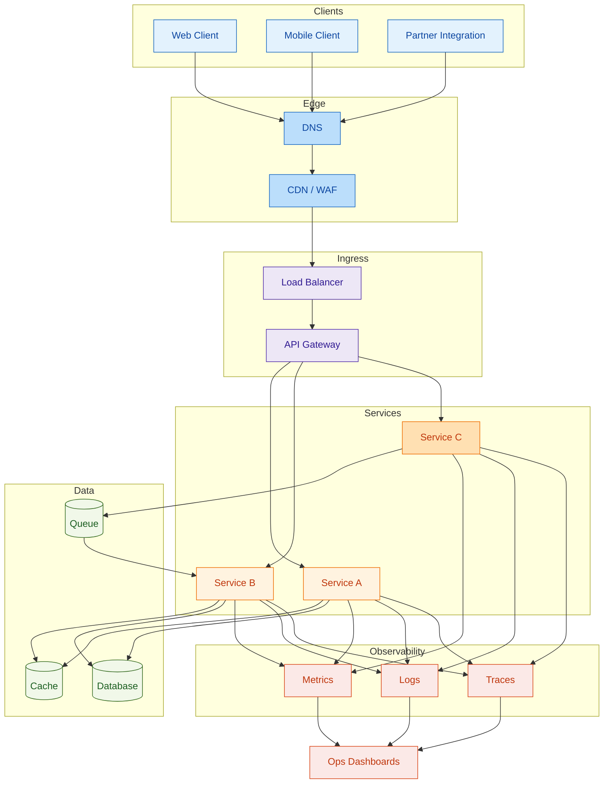

# System Design Architecture Map

**Legend**
- Sync Service: Service A / Service B
- Async Service: Service C (Queue)
- Data Stores: Cache, Database, Queue
- Observability: Metrics, Logs, Traces feeding Ops dashboards
