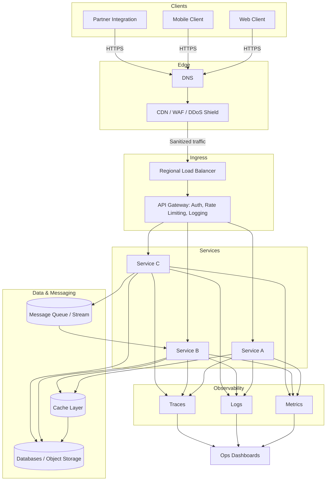

# System Design Architecture Map (Draft)

**Notes**
- Edge layer (CDN/WAF) absorbs DDoS traffic and serves static assets; sanitized traffic flows to load balancers.
- API gateway enforces authentication and rate limiting before routing to services.
- Services interact with cache, message queues, and data stores while emitting observability data.
